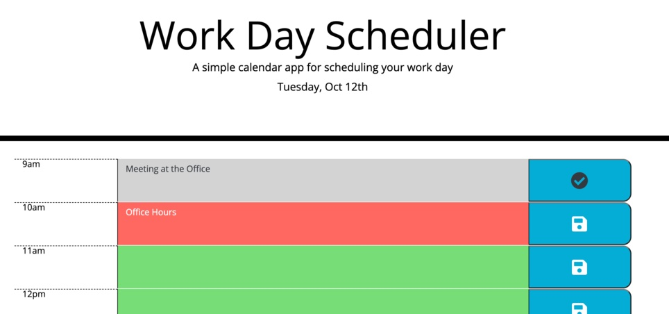

# 05-Homework-Day-Planner

## Your Task

Create a simple calendar application that allows a user to save events for each hour of the day by modifying starter code. This app will run in the browser and feature dynamically updated HTML and CSS powered by jQuery.

## Criteria

    - Use existing HTML provided to create a Day Planner
    - Display the current date in the header of the page
    - Dynamically create rows of timeblocks corresponding to standard business hours (9-5)
    - Color code blocks based upon time of day (whether that time is in the past, present or future)
    - Allow information to entered into timeblock and saved upon clicking the corresponding button
    - Store tasks entered into blocks to localStorage to be repopulated later upon refreshing page.

## Skills Used
    - Javascript
    - JQuery
    - CSS
    - Bootstrap
    - MomentJS
    - LocalStorage
## Final Product

https://tallen1985.github.io/05-Homework-Day-Planner/